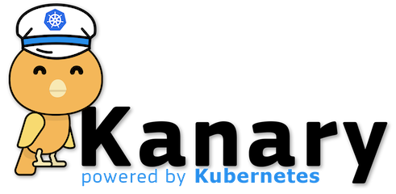
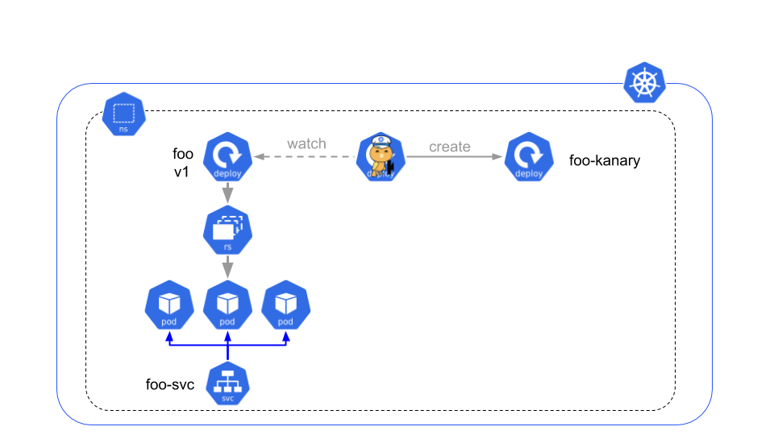
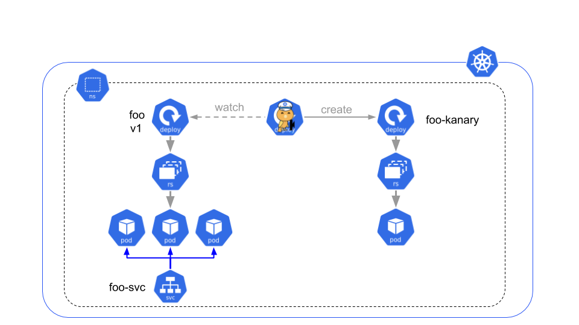
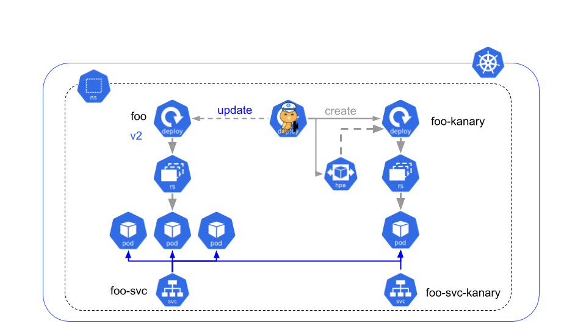
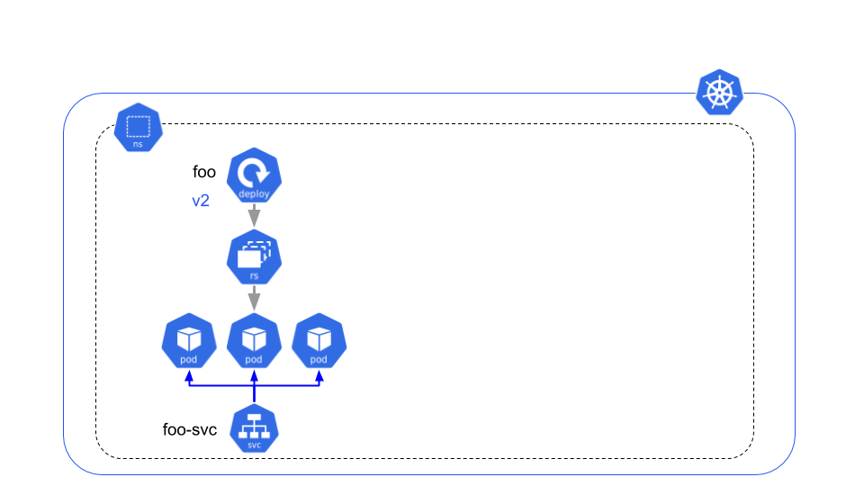

Kanary
======

## Purpose

The goal of Kanary project is to bring full automation of Canary Deployment to kubernetes. So far only rolling update is automated and fully integrated to Kubernetes.  Using CRD (Custom Resource Definition) and an associated controller, this project will allow you to define your Canary deployment and chain it with a classic rolling update in case of success.

The Kanary CRD allows you to define the 3 main blocks of a Canary Deployment:
- The deployment of the canary instance
- The traffic management toward your canary instance
- The validation phase

Of course the Kanary CRD embedded a classic deployment object defintion as template. A dedicated pluggin will allow you to convert a classic deployment to a Kanary deployment using default values.

No need for external tool to orchestrate the different phase, the creation and deletion of dedicated services and pods. Describe what you expect and let the controller do the job. Each phase comes with multiple options that will give full control on how you want to proceed.

Note that it is possible to run multiple Kanary on top of the same deployment, and that the history of the original deployment is preserved (classic roolback capability is preserved).

The next chapters will detail all possible options. Have a good Kanary testing!

## How to use it

The `KanaryDeployment.Spec` is split in 4 different part:

- `KanaryDeployment.Spec.Template`: represents the `Deployment` template that is it instantiated as canary deployment, and also as the Deployment update if the KanaryDeployment succeed.
- `KanaryDeployment.Spec.Scale`: aggregates the scaling configuration for the canary deployment.
- `KanaryDeployment.Spec.Traffic`: aggregates the traffic configuration that targets the canary deployment pod(s). it can be live traffic (behind the same service that the deployment pods), behind a specific "kanary" service, or receiving some "mirror" traffic.
- `KanaryDeployment.Spec.Validation`: this section aggregates the kanaryDeployment validation configuration.

### Scale configuration

Currently, two scale configurations are available: `static` and `hpa`.

#### Static scale

With static configuraiton you need to set manualy the canary deployment replica factor.

```yaml
spec:
  #...
  scale:
    static:
      replicas: 1
  #...
```

#### HPA (HorizontalPodAutoscaler) scale

With `hpa` scale configuration, a HorizontalPodAutoscaler resource will be created attach to the canary deployment. Parameters are identic with the  `HorizontalPodAutoscaler.spec` with the exception of `HorizontalPodAutoscaler.spec.scaleTargetRef` what it set by the canary-controller.

```yaml
spec:
  #...
  scale:
    hpa:
      maxReplicas: 5
  #...
```

### Traffic configuration

In the traffic section, the can define which source of traffic is targeting the canary deployment pods. Kanary defines several "sources":

- `service`: canary pods are part of the pod behind the "production" service.
- `kanary-service`: canary pods are behind a dedicated service, what is created by the Kanary controller. Canary pods don't received any production traffic.
- `both`: in the case, the kanary-controller is configured to allow the canary pods to receive traffic like the `service` and `kanary-service` are configured in parallel.
- `mirror`: canary pods are targeted by "mirror" traffic, this `source` depends on an Istio configuration.
- `none`: canary pods didn't receive any traffic from a service.

```yaml
spec:
  # ...
  traffic:
    source: <[service|kanary-service|both|mirror|none]>
  # ...
```

### Validation configuration

Kanary allows different mechanisms to validate that a KanaryDeployment is successfull or not:

- `manual`: this validation mode requests to the user to update manually a field `spec.validation.manual.status` in order to inform the Kanary-controller that it can consider the canary deployment as "valid" or "invalid".
- `labelWatch`: in this mode, the Kanary-controller will watch the present of label(s) on canary deployment|pod in order to know if the KanayDeployment is valid. If after the `spec.validation.validationPeriod` the controller didn't see the labels present on the pods or deployment, it means the KanaryDeployment is valid.
- `promQL`: this mode is using prometheus metrics for knowing if the KanaryDeployment is valid or not. The user needs to provide a PromQL query and prometheus server connection information. The query needs to return "true" or "false", and can benefit from some templating value (deployment.name, service,name...)

Then some common fields in the validation section:

- `spec.validation.validationPeriod`, This is the minimum period of time that the canary deployment needs to run and be considered as valid, before considering the KanaryDeployment as succeed and start the deployment update process.
- `spec.validation.noUpdate`, by default set to "false", which means that the deployment is updated in case of a success canary deployment validation. If `noUpdate` is set to "true", the deployment is not updated despite the validation success.

```yaml
spec:
  # ...
  validation:
    validationPeriod: 15m
    noUpdate: false
    # ...
```

#### Manual

In `manual` validation strategy, you can initiate the configuration with an additional parameter: `spec.validation.manual.statusAfterDeadline`. This parameter will allow the kanary-controller to know if it needs to consider the KanaryDeployment as `valid` or `invalid` after the `validationPeriod`. if this parameter is set to `none` which is the default value, the kanary-controller will not take any decision after the `validationPeriod` and it will wait that you update the `spec.validation.manual.status` to `valid` or `invalid` to take action.

```yaml
spec:
  # ...
  validation:
    validationPeriod: 15m
    manual:
      statusAfterDeadline: <[valid,invalid,none]>
      #status:
  # ...
```

#### LabelWatch

The `labelWatch` validation strategy allows to configure some invalidation labels on Kanary pods or deployment. If present, the Kanary controller will consider the `KanaryDeployment` as failed.
To be successful, the KanaryDeployment need to running during the full `validationPeriod` without any `deploymentInvalidationLabels` or `deploymentInvalidationLabels` labels match.

```yaml
spec:
  # ...
  validation:
    validationPeriod: 15m
    labelWatch:
      deploymentInvalidationLabels:
        validation: "failed"
  # ...
```

another example:

```yaml
spec:
  # ...
  validation:
    validationPeriod: 15m
    labelWatch:
      podInvalidationLabels:
        monitoring-alert: "high-cpu"
  # ...
```

#### PromQL

// TODO

### Basic example

the following yaml file is an example of how you create a "basic" KanaryDeployment:

```yaml
apiVersion: kanary.k8s.io/v1alpha1
kind: KanaryDeployment
metadata:
  name: nginx
  labels:
    app: nginx
spec:
  serviceName: nginx
  deploymentName: nginx
  scale:
    static:
      replicas: 1
  traffic:
    source: both
  validation:
    manual:
      statusAfterDeadline: none
  template:
    # deployment template
```

This artifact will trigger the creation of a new deployment: `canary` Deployment: its name will be the KanaryDeployment name with the prefix "-kanary"

Also, a Service will be created in order to target only the Canary pods managed by the `canary` Deployment. This service is created only if the `KanaryDeployment.spec.serviceName` is defined.

#### Validate the KanaryDeployment with the manual mode

When you consider the canary deployment enough tested you can update the `spec.validation.manual.status` to `valid`or `invalid`.

- If you have chosen `valid`, automatically the kanary-controller will trigger the deployment update with the same template used to create the canary-deployment.
- If you have chosen `invalid`. the KanaryDeployment status will be set as `Failed`, no additional action will be possible. Also, the canary pods will be removed from the "production" service.

Finally when you delete the KanaryDeployment instance, all the other resources created linked to it, will be also deleted.

## Kubectl kanary plugin

```shell
$ make build-plugin
$ PATH="$(pwd):$PATH"
# then you can use the plugin
$ kubectl kanary --help
Usage:
  kubectl kanary [command]

Available Commands:
  generate    generate a KanaryDeployment artifact from a Deployment
  get         get kanary deployment(s)
  help        Help about any command
```

## Kanary explains with Diagrams

When you start a new Kanary the controller strat watching the associated deployment. If there is none, it will create it.


The the controller start creating the associated Kanary deployment.



Kubernetes start creating the pods for the Kanary deployment.



If you want an "elastic" canary you can ask to use HPA for the Kanary deployment.


The controller will also create a dedicated service to target the Kanary instances. 


As explained in the **traffic**, the Kanary can receive traffic from only that service, or only live traffic like the classic deployment, or a mix of both.


Now that your Kanary receives traffic, it is time for validation. If the validation fails all the Kanary resources are deleted and the initial deployement remains as it has always been.

In case the validation phase succeeds, the deployment will be updated with the new version that was used in the Kanary.



Once the Kanary validation is complete (success and rolling update started or failure), all the Kanary resources are cleaned automatically by the controller.

The Kanary CRD is still remain so that you can read its status. Interesting in case of failure most of the time.

